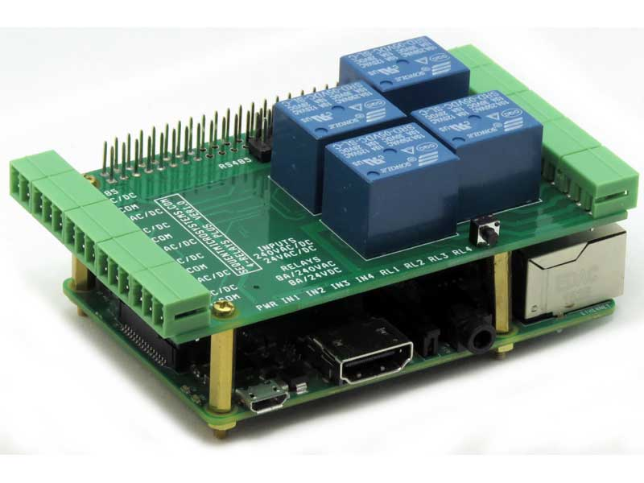

[](https://www.sequentmicrosystems.com)

[]([https://www.sequentmicrosystems.com](https://sequentmicrosystems.com/collections/all-io-cards/products/four-relays-four-inputs-for-raspberry-pi))

# 4rel4in-rpi
Drivers to control Sequent Microsystems [Four Relays four HV Inputs 8-Layer Stackable HAT for Raspberry Pi](https://sequentmicrosystems.com/collections/all-io-cards/products/four-relays-four-inputs-for-raspberry-pi) V 4.0 or higher

The card V4.0 add the following features related to the optocoupled inputs:
* Transitions count for ech inputs.
* Filtred inputs state reading for AC signals input.
* Pulse per seconds for the counters.
* 2 x Quadrature encoder inputs on in 1/2 and 3/4
* PWM inputs on ech channel, reading the fill factor and frequency
* The 4 LED's asignated to the inputs can be software controlled

## Setup (first usage of a Sequent Microsystems card)
 - Enable the I2C communication:
```bash
~$ sudo raspi-config
```
Go to the "Interface Options">>"I2C" menu and select "Yes"

 - Update your Raspberry PI and install the tools you need:
 ```bash
~$ sudo apt-get udate
~$ sudo apt-get upgrade
~$ sudo apt-get install git
```


## Install

```bash
~$ git clone https://github.com/SequentMicrosystems/4rel4in-rpi.git
~$ cd 4rel4in-rpi/
~/4rel4in-rpi$ sudo make install
```
## Usage
Now you can access all the functions of the card through the command "4rel4in". Use -h option for help:
```bash
~$ 4rel4in -h
```
## Update
If you clone the repository any update can be made with the following commands:

```bash
~$ cd 4rel4in-rpi/  
~/4rel4in-rpi$ git pull
~/4rel4in-rpi$ sudo make install

